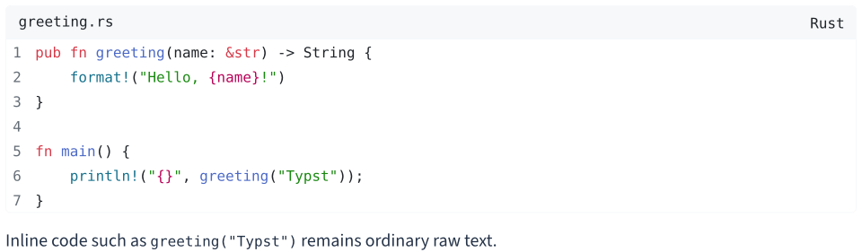
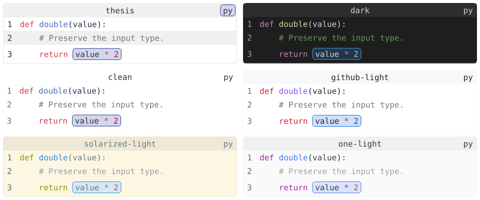
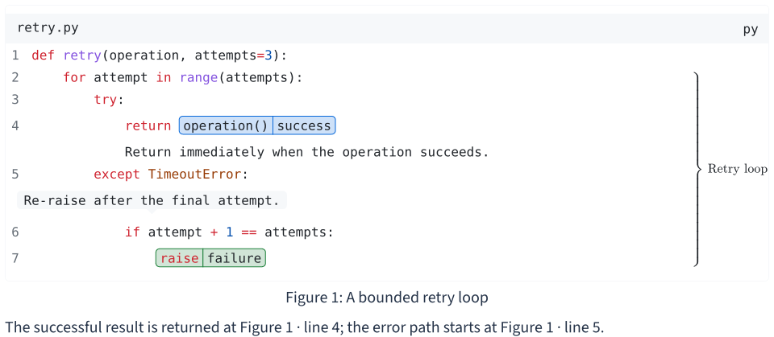
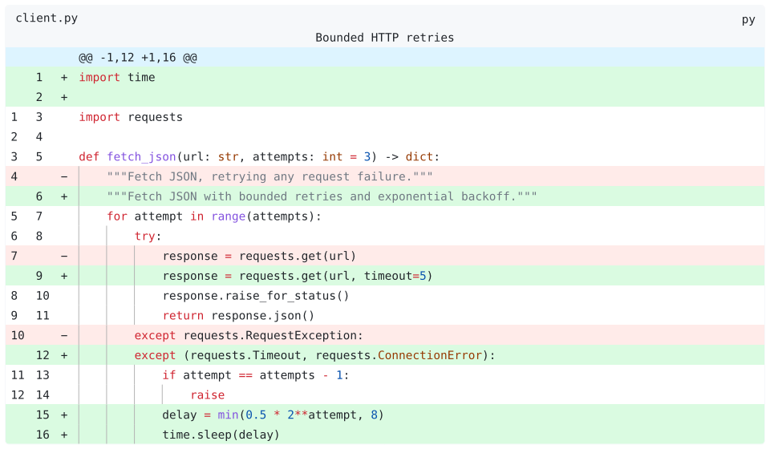
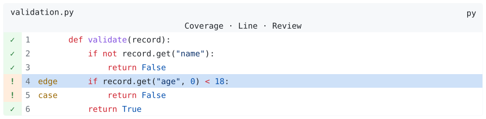
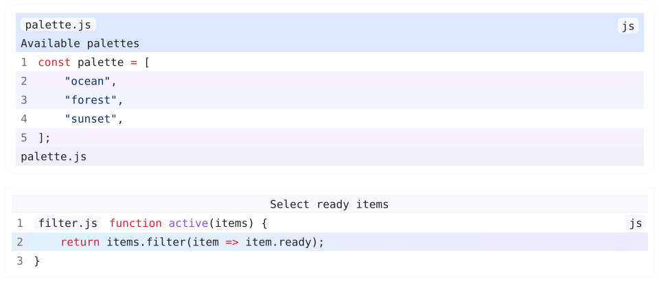
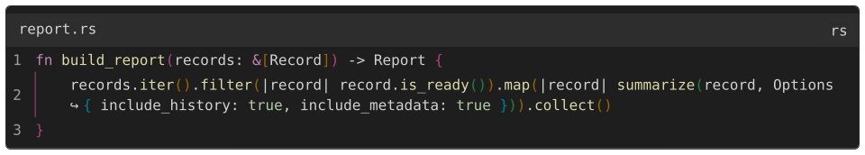
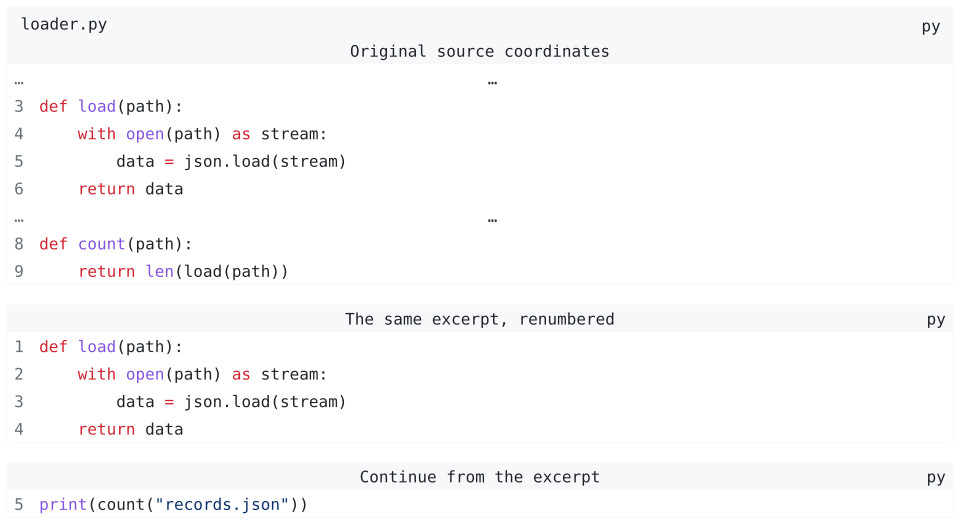

# 🐟 Codly

<p align="center">
  <a href="https://codly.dherse.dev">
    
  </a>
  <a href="https://github.com/Dherse/codly/blob/main/LICENSE">
    
  </a>
  
</p>

Code blocks for Typst with line numbers, references, annotations, themes, custom
gutters, and syntax-aware diffs.

This branch prepares **v2.0.0** and requires **Typst 0.15.0 or newer**. Until v2 is
published, import `"codly.typ"` from this checkout, or run `just install` and use
`"@local/codly:2.0.0"`. The `@preview` imports below are for the upcoming release.

## Quickstart

One show rule converts ordinary fenced blocks. Inline code stays untouched.

````typ
#import "@preview/codly:2.0.0" as codly
#show raw.where(block: true): codly.new

```rs
pub fn greeting(name: &str) -> String {
    format!("Hello, {name}!")
}
```
````

[](https://github.com/Dherse/codly/blob/v2.0.0/examples/quickstart.typ)

[Rendered example source](examples/quickstart.typ). The screenshot also applies
the `github-light` theme and a filename badge.

For icons and language names, the optional
[codly-languages](https://typst.app/universe/package/codly-languages/) companion
works through the language component:

```typ
#import "@preview/codly:2.0.0" as codly
#import "@preview/codly-languages:0.1.8": codly-languages
#show: codly.lang-set_(languages: codly-languages)
#show raw.where(block: true): codly.new
#raw("print(42)", lang: "py", block: true)
```

## Explicit blocks and scoped defaults

Use `codly.new` for per-block settings, literal source strings, or caller-resolved
file paths. No initialization rule is required for explicit blocks.

```typ
#import "@preview/codly:2.0.0" as codly
#codly.new(raw("return value", lang: "py", block: true), file: "result.py")
#codly.new("print(42)", lang: "py", file: "answer.py")
// For a real source file: #codly.new(path("src/main.rs"))
```

Defaults are ordinary scoped show rules, not persistent global state. Place
automatic conversion in a content block when it should apply only there:

````typ
#import "@preview/codly:2.0.0" as codly
#[
  #show: codly.theme("dark")
  #show: codly.set_(padding: 4pt, radius: 5pt)
  #show: codly.number-set_(numbering: "1.")
  #show raw.where(block: true): codly.new
  ```py
  print("styled")
  ```
]
// Outside that scope, code blocks retain native Typst formatting.
````

To opt out selected blocks document-wide, use a single conditional conversion
rule instead of the unconditional one:

```typ
#import "@preview/codly:2.0.0" as codly
#show raw.where(block: true): it => if it.lang == "plain" { it } else { codly.new(it) }
#raw("native formatting", lang: "plain", block: true)
#raw("print(42)", lang: "py", block: true)
```

## Themes

Choose `thesis` (the defaults), `dark`, `clean`, `github-light`,
`solarized-light`, or `one-light`. Each preset includes a five-color highlight
palette. Theme settings remain overridable by subsequent component rules.

```typ
#import "@preview/codly:2.0.0" as codly
#show: codly.theme("github-light", accent: rgb("8250df"))
#codly.new(raw("return value * 2", lang: "py", block: true))
```

[](https://github.com/Dherse/codly/blob/v2.0.0/examples/themes.typ)

[Theme example](examples/themes.typ) · [Theme definitions](src/themes.typ)

## Highlights, annotations, and references

Span highlights can carry tags and labels; braces annotate line ranges; callouts
can follow source indentation or point to a character. References are native
Typst references: use `@block:5` for a line and `@highlight` for a labeled span.
Put labeled highlights inside a figure.

Highlight character positions are **one-based and inclusive**, counting leading
indentation. On `            return operation()`, `operation()` is positions
20–30. Omitted bounds select the corresponding line edge; whitespace runs stay
whole when a boundary falls inside them.

[](https://github.com/Dherse/codly/blob/v2.0.0/examples/annotations.typ)

[Annotation and reference example](examples/annotations.typ)

## Syntax-aware diffs

Set `lang: "diff,py"` (or another language) on a raw block. Codly highlights old
and new source separately, strips patch markers from the code, and adds old/new
number and change-marker gutters. Unified hunks and simple `-`/`+` fragments are
supported. Diff colors and gutters are configurable; themes supply matching
defaults.

```typ
#import "@preview/codly:2.0.0" as codly
#codly.new(raw("-return 1\n+return 2", lang: "diff,py", block: true))
```

Use `raw(...)`: Typst 0.15 does not parse a comma-containing fenced language tag
as `diff,py`.

[](https://github.com/Dherse/codly/blob/v2.0.0/examples/diff.typ)

[Diff example](examples/diff.typ)

## Custom gutters

Add columns with arrays or row callbacks, independent fills, widths, alignment,
and typography. Array entries refer to original source lines, even in excerpts.
Include `auto` in `gutters` to retain the ordinary number column; `gutters: ()`
hides all gutters.

[](https://github.com/Dherse/codly/blob/v2.0.0/examples/gutters.typ)

[Gutter example](examples/gutters.typ)

## Fills and layout

`codly.line-set_(fill: ...)` accepts a paint, a cycling array of paints, or a
function receiving the row. A row includes `index`, `kind`, `source-line`,
`number`, and `text`. Generated rows may have no source line or text; guard those
fields in callbacks. Header and footer styles are independent. `padding`
controls block-edge space separately from row insets and leading.

[](https://github.com/Dherse/codly/blob/v2.0.0/examples/presentation.typ)

[Fill and layout example](examples/presentation.typ)

## Wrapping and indentation

Smart indentation is enabled by default. Indentation guides, rainbow delimiters,
and continuation markers are opt-in through `indent-guides`, `rainbow`, and
`wrap-marker`. Wrapped rows retain their original source number.

[](https://github.com/Dherse/codly/blob/v2.0.0/examples/wrapping.typ)

[Wrapping example](examples/wrapping.typ)

## Excerpts and numbering

`range` selects one interval; `ranges` selects multiple intervals. `offset`
accepts a number, `auto` to start the excerpt at one, or a block/figure label to
continue its last displayed number. Disjoint excerpts preserve their gaps.
`codly.info(label)` exposes `lines` and `last-number` in context.

[](https://github.com/Dherse/codly/blob/v2.0.0/examples/excerpts.typ)

[Excerpt example](examples/excerpts.typ)

## Migrating from v1

- Replace `codly-init` and configuration calls with `codly.new` and scoped
  `#show: codly.set_(...)` or component rules.
- Exported component names are unprefixed: `codly.line`, `codly.highlight`,
  `codly.header`, and so on. Their internal selector identities still use
  `codly-...`. Component helpers consistently end in `_`, including
  `header-set_`, `header-show_`, `footer-set_`, and `footer-show_`.
- Use `codly.lang-set_(languages: ...)` for language definitions,
  `codly.number-set_(numbering: ...)` for numbers, and
  `codly.highlight-set_(...)` for highlight styling.
- Replace zebra-specific settings with a `fill` palette or callback.
- Replace `offset-from` and offset helper calls with the single `offset` field.
- Ranges and span positions are one-based; highlight ends are inclusive.

See [CHANGELOG.md](CHANGELOG.md) for release history and contributor credits.
The [online manual](https://codly.dherse.dev/) describes the new v2 API with a migration guide.
